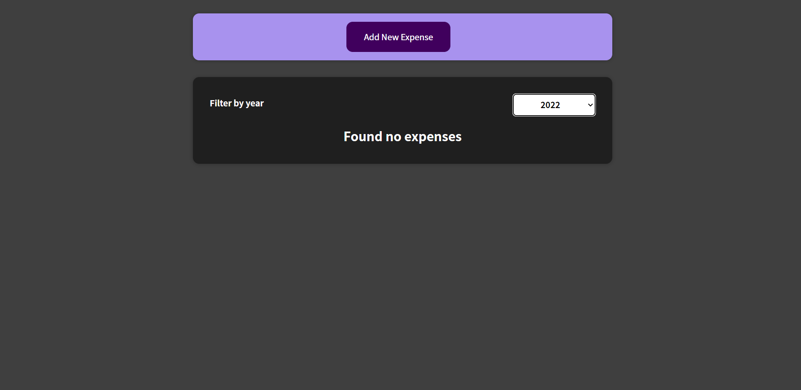
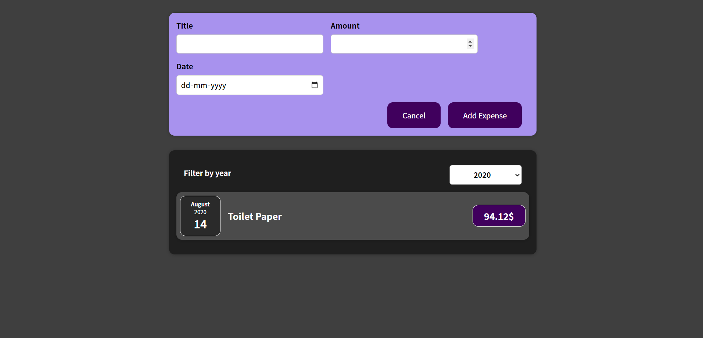
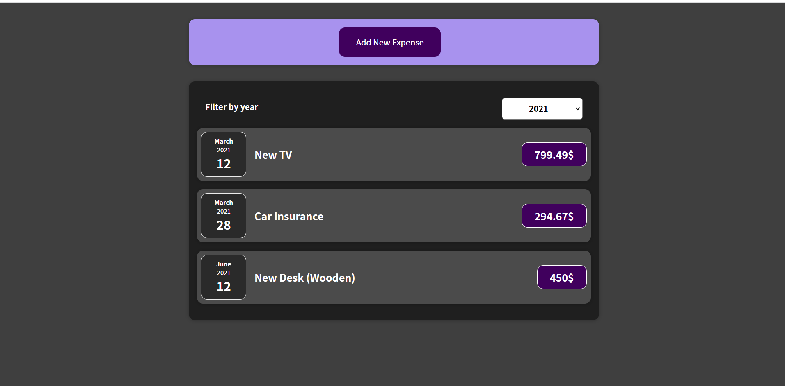

## Functionalities of Expense Tracker
- Add New Expenses.
- Filters expenses based on year.
- Conditional Rendering implemented.
- Data is taken from the user.
- Mobile responsive

## Tech Stack
- React JS
- HTML
- CSS

## Demo




## Want to run this  project ??
1. Fork & clone this repository 
```
git clone https://github.com/siddhi-244/Expense-Tracker.git
```

2. Install all the dependencies.

```
npm install

```

3. Run the React app.
```
npm start
```


